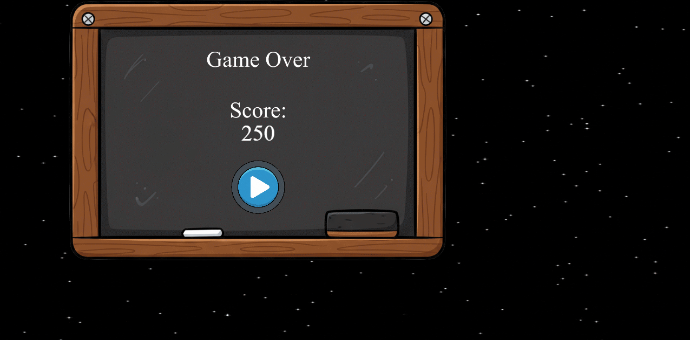
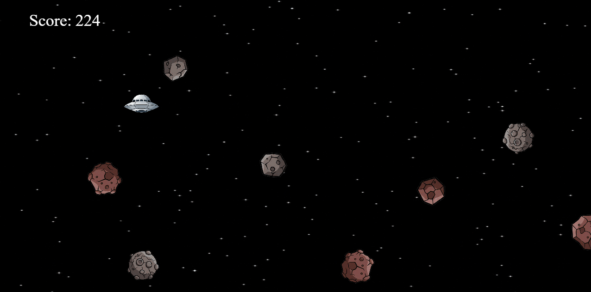
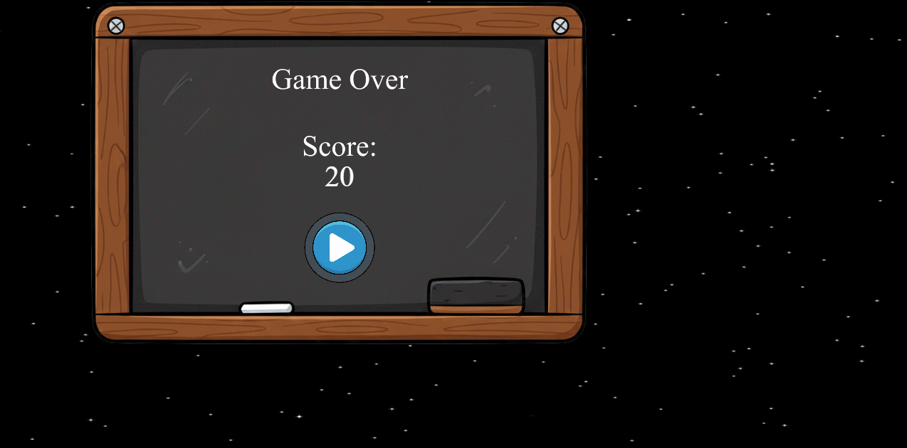

Astro Launch – HTML5 Game

A school project created using Adobe Animate HTML5 Canvas and CreateJS, developed by Khian Victory D. Calderon and Rafael Metran.
The game features an interactive UFO-asteroid dodging gameplay with increasing difficulty over time.

🎮 Game Overview

Astro Launch is a fast-paced HTML5 mini-game where you control a UFO and dodge incoming asteroids.
As time passes, asteroids become faster, more frequent, and harder to avoid, making the game progressively challenging.

Your score increases automatically while you survive. One hit = Game Over.

🔗 Live Demo

Play the Game Here: [Astro Launch on GitHub Pages](https://khianvictorycalderon.github.io/Astro-Launch/)

📸 Screenshots

**Home Screen**  

**Gameplay**  

**Game Over Screen**  

🕹️ Gameplay & Controls

Movement:

Arrow Up / W – Move up

Arrow Down / S – Move down

Arrow Left / A – Move left

Arrow Right / D – Move right

Goal:
Avoid all asteroids for as long as possible. The longer you survive, the higher your score.

✨ Project Features

✔ Home screen with Play button
✔ Game Over screen with final score display
✔ Real-time scoring system
✔ Dynamic asteroid generation
✔ Increasing difficulty (more asteroids + faster speeds)
✔ Smooth movement using CreateJS tick updates
✔ Organized code structure for readability

🧠 How the Game Works (Technical Summary)

This project uses Adobe Animate to design graphics and export a CreateJS-based game.
Important mechanics include:

UFO Movement

Moves based on keyboard input

Cannot leave screen boundaries

Position updates every tick (60 FPS)

Asteroid System

8 asteroid types (as_a to as_h)

Asteroids spawn outside the screen and move left

Spawn rate increases over time

Speed increases continuously

Each asteroid has rotation + random variations

Collision Detection

The game checks transformed bounds of the UFO and asteroids every frame:

If they overlap → Game Over

Score stops, ship disappears, asteroids are cleared

Game Over screen displays final score

📁 File Structure
Astro-Launch
│
├── index.html
├── code.js
├── Astro-Launch.js        ← Adobe Animate export
├── createjs.min.js
├── Astro_Launch_atlas_1.png
├── images/
│   └── Astro_Launch_atlas_1.png
├── src/
│   ├── Astro-Launch.fla
│   ├── code.js
│   └── ...
└── README.md

🚀 How to Run the Game

Download or clone this repository.

Open index.html in any modern browser (Chrome recommended).

Start playing immediately — no installation needed.

If hosting on GitHub Pages:
Just enable Pages → choose main → /root folder → your game runs online.

👥 Contributors

Developed by:

Khian Victory D. Calderon

Rafael Metran

📌 Notes

This project was created as a school requirement to demonstrate:

event handling

animation principles

basic game logic

Adobe Animate to HTML5 workflow

JavaScript CreateJS programming